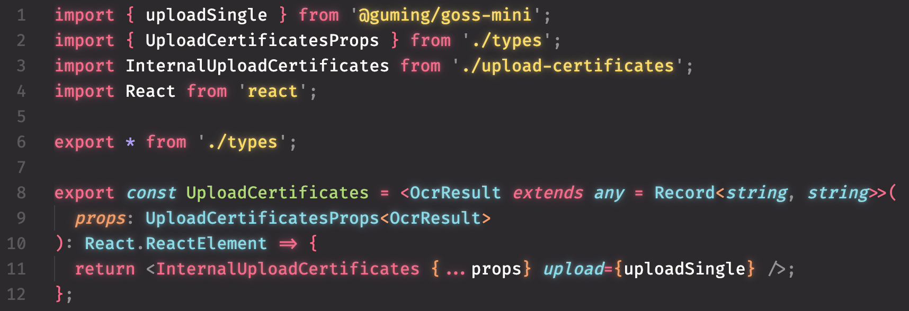

  

<h1 align="center">Code Glow</h1>

English / [简体中文](./README_CN.md)

make your code glow like a neon light!

## Enable Glow Effect

press `Command + Shift + P` and type `code-glow.enableGlow` to enable glow effect

## Disable Glow Effect

press `Command + Shift + P` and type `code-glow.disableGlow` to disable glow effect
